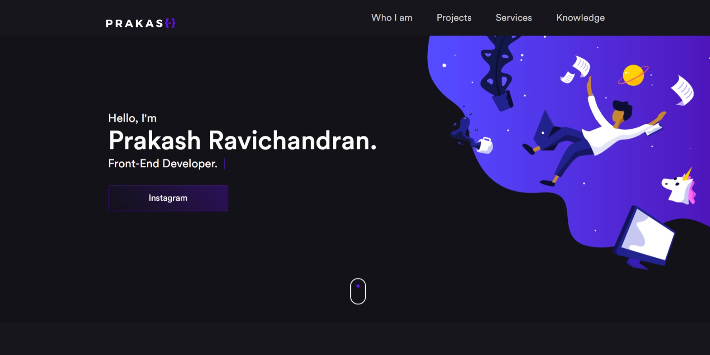

 <h1 align = "center">
 💻  Animated Portfolio
 </h1>

 <h4 align = "center"> <a href="https://prakasravichandran.github.io/portfolioo/"> Click to visit the Project </a> </h4> 

 ## 📚 Sections

 The site consists of five sections:

 - **Home:** In it we have a brief presentation;
 - **Who I am:** In this section I have a description saying a little about who I am;
 - **Experience:** I approach some companies from which I provided my services in the area of ​​development and design;
 - **Projects:** Presents some projects developed and with direct link to the respective codes in Github;
 - **Services:** Displays through cards the different services in which I have knowledge;
 - **Knowledge:** In it we present my knowledge in some languages ​​such as the focus on the front end;

 ---

 ## 💼 Technologies used

 For the development of this site I used the following technologies:

 - HTML;
 - Sass;
 - JavaScript;
 - Scrollveal;
 - SVG Inject;

 ---

 <H2> 🦄 Author </h2>

 <table>
  <tr>
    <td align="center">
      <a href="https://github.com/PrakasRavichandran">
         
        
          <b>Prakash Ravichandran</b>
        
      </a>
    </td>
  </tr>
</table>
