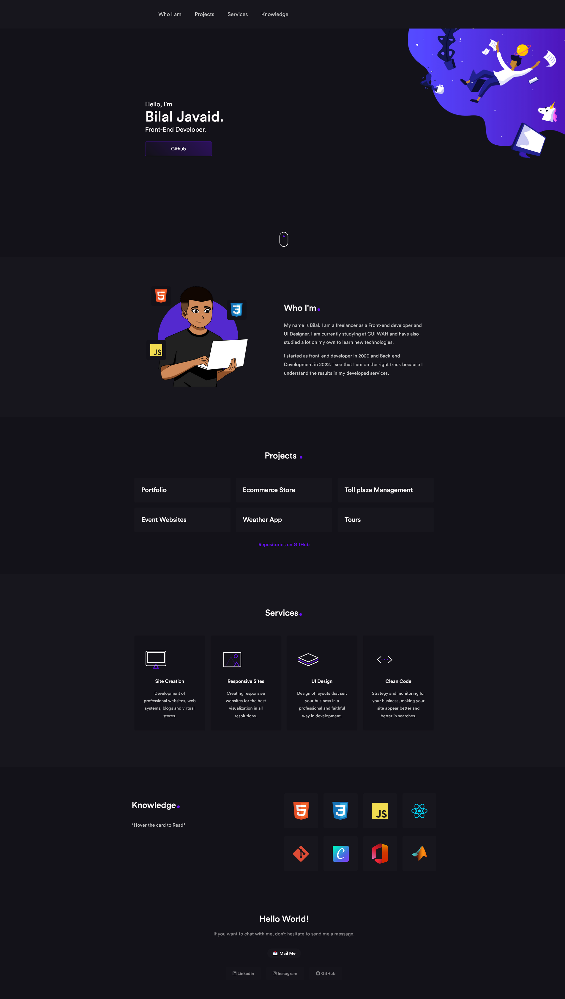

 <h1 align = "center">
 💻  Animated Portfolio
 </h1>

 <h4 align = "center"> <a href=""> Click to visit the Project </a> </h4> 

 ## 📚 Sections

 The site consists of five sections:

About: This section presents a brief introduction to my professional profile and career objectives.  
Experience: This section provides a summary of my work experience, including past companies and projects I have contributed to as a developer and designer.  
Projects: In this section, you can find a selection of my recent projects, along with links to their source code repositories on Github.  
Services: This section showcases the different services I offer, with detailed information about my skills and expertise.  
Skills: This section highlights my technical competencies in areas such as front-end development, software engineering, and design.  
Contact: This section provides my contact information, including email, and social media profiles, as well as a contact form for inquiries.  

 ---

 ## 💼 Technologies used

 For the development of this site I used the following technologies:

 - HTML;
 - Sass;
 - JavaScript;
 - Scrollveal;
 - SVG Inject;

 ---

 <H2> 🦄 Author </h2>

 <table>
  <tr>
    <td align="center">
      <a href="https://github.com/Bilal3940">
         
        
          <b>Bilal Javaid</b>
        
      </a>
    </td>
  </tr>
</table>
